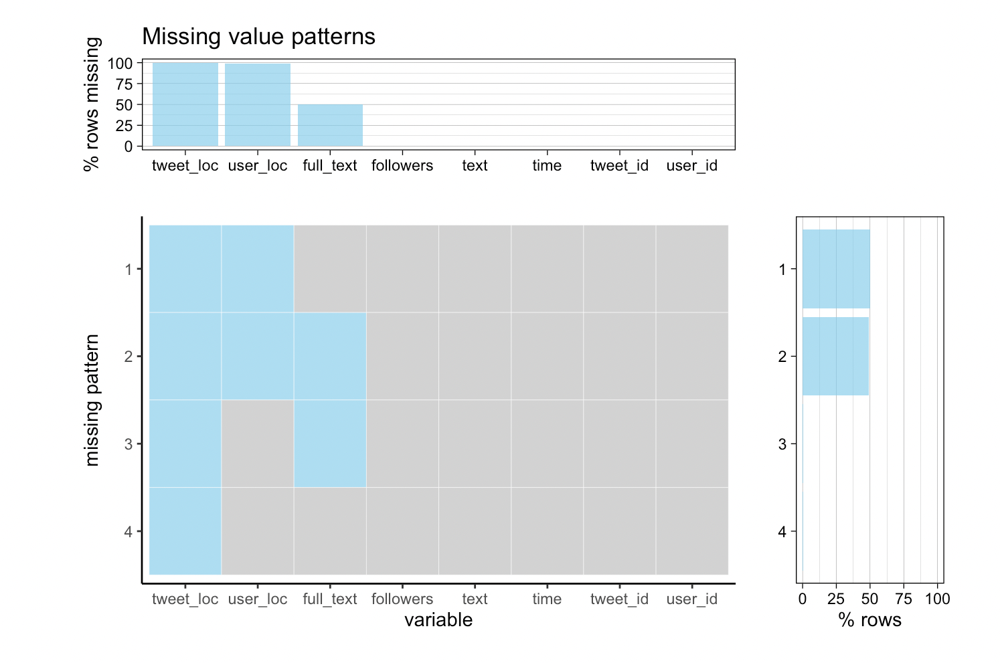

# Missing values

## Twitter Dataset 

By using Tweepy API, we collected tweets data using keywords: “Elon Musk”, “Tesla”, “@elonmusk” for half a month and decided to pick a continuous 7-day period for the final evaluation.

Here we use the data collected on 10/28/2021. There are a total of 65,965 tweets. Of all the 8 features we selected, 3 of the them have missing values. They are `tweet_loc`, `user_loc`, `full_text`. The following is a missing value graph presenting missing value distributions and patterns.

As shown in the graph, the `tweet_loc` column has the most missing values which only contains 4 valid values in total. By data description, it indicates that Twitter users seldom specify details about the location tagged in the Tweet. Another largely missing data column is `user_loc` with 683 valid values. `user_loc` is a self-identified location by the user, and is has the format like 'Manhattan, NY'. We think the result is intuitive as users tend not to share private geological information. The missing value in `text` is interesting. `text` can only holds up to 140 character and if a tweet exceeds the limit, `full_text` is the feature that will capture the complete contents. We see that around half of the users write short text when post tweets related to Elon Musk.

Looking at the missing patterns. About half of the tweets are missing `tweet_loc` and `user_loc`, and the other half has additional missing value in `full_text`. The other two missing patterns are trivial. Overall, we are aware of the fact that most of tweet_loc and user_loc features are missing. Geological analysis might not be plausible as of the high percentage of the missing values. However, we are still interested in finding the possible correlation between the missingness and sentiment of the text, or if it is related to the length of the text.