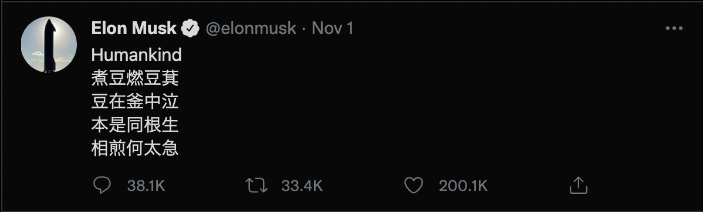
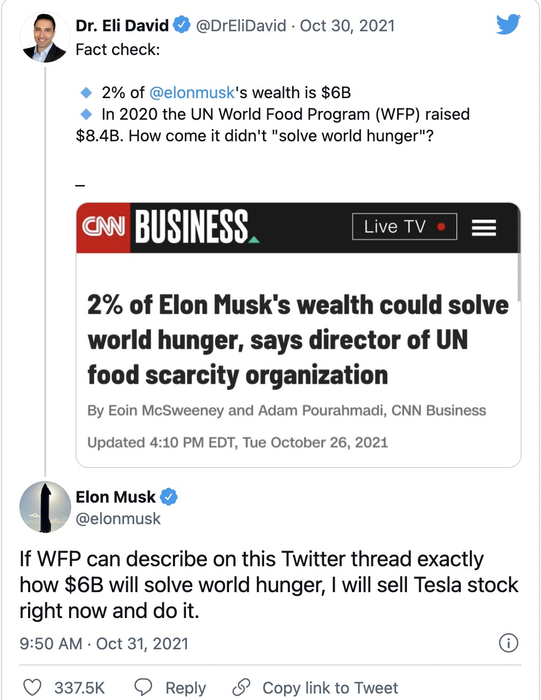

# Results
```{r, message=FALSE, warning=FALSE}
library(jsonlite)
library(tidyverse)
library(dplyr)
library(knitr)
library(tokenizers)
library(syuzhet)
library(ggplot2)
library(tm)
library(tidytext)
library(wordcloud)
library(lubridate)
library(scales)
library(usmap)
library(emo) 
library(gt)
```

```{r}
#Read in the dataset
df <- read.csv("data/EM_df.csv",encoding="latin1")
df <- df %>%
  select(-c(X,geo.type,geo.coordinates)) 

```

```{r}
#Reformat timestamp
df <- df %>%
  mutate(created_at = as.character(strptime(created_at,"%a %b %d %H:%M:%S %z %Y", tz = "EST"))) %>%
  mutate(date = as.Date(created_at))

```

```{r}
#Calculate the duration of collecting period for each day
df_1028 <- df %>%
  filter(date=="2021-10-28")

dt1028 <- difftime(df_1028$created_at[nrow(df_1028)], df_1028$created_at[1], unit="hours")

df_1029 <- df %>%
  filter(date=="2021-10-29")

dt1029 <- difftime(df_1029$created_at[nrow(df_1029)], df_1029$created_at[1], unit="hours")

df_1030 <- df %>%
  filter(date=="2021-10-30")

dt1030 <- difftime(df_1030$created_at[nrow(df_1030)], df_1030$created_at[1], unit="hours")

df_1031 <- df %>%
  filter(date=="2021-10-31")

dt1031 <- difftime(df_1031$created_at[nrow(df_1031)], df_1031$created_at[1], unit="hours")

df_1101 <- df %>%
  filter(date=="2021-11-01")

dt1101 <- difftime(df_1101$created_at[nrow(df_1101)], df_1101$created_at[1], unit="hours")

df_1102 <- df %>%
  filter(date=="2021-11-02")

dt1102 <- difftime(df_1102$created_at[nrow(df_1102)], df_1102$created_at[1], unit="hours")

df_1103 <- df %>%
  filter(date=="2021-11-03")

dt1103 <- difftime(df_1103$created_at[nrow(df_1103)], df_1103$created_at[1], unit="hours")

tn <- c(dt1028,dt1029,dt1030,dt1031,dt1101,dt1102,dt1103)
tn <- as.numeric(tn)
```

## Elon Musk

Elon Musk is very active on twitter and anything he tweets can be very influential and brings a lot of controversies. For example, his tweet about the crypto-currency "dogecoin" caused "dogecoin" price to spike. Since Twitter users have many discussions surrounding him, our analysis aims to visualize those discussions. 

The period of which we collected our data was very interesting. It was shortly after Tesla flied in stock market and Elon Musk became the richest man in the world. He was also asked by the United Nation to donate 4% of his growing wealth to solve a hunger crisis. Just shortly after that, on Nov. 1st, he posted a Chinese poem "七步诗" titled as "Humankind".




## Volume of tweets

We first carried out analysis on the number of tweets that we collected each day. Due to some technical issues, the durations we collected tweets each day are different. They were about 10-12 hours each day, with one excepetion on Oct 29. On that day, we collected tweets for about 5.5 hours. In order to present a consistent results through the period, we standardize the tweets by dividing the total collected hour and multiplying by 24. The following graph presents expected number of tweets each day.

```{r}
time_df <- df %>% 
  group_by(date) %>%
  count() %>%
  filter(is.na(date) == FALSE) %>%
  add_column(period=tn) %>%
  mutate(standardized= (n*24)/period) %>%
  ungroup

ggplot(time_df, aes(date,standardized)) +
    geom_line(color="lightblue3") + 
    scale_x_date(date_breaks="1 day") +
    ggtitle("Expected number of tweets each day") +
    xlab("Date") +
    ylab("Standardized number of tweets") +
    theme_bw()
```

From the graph, we see that the volume each day can be as low as 70 thousands and as high as 250 thousands. There were two peaks on Oct. 29th and Nov 1st. For the first peak, we corresponded it to the drastic increase in Tesla's stock price. For the second peak, we related to the conversation between an United Nation offical and Elon Musk. We notice from below that this conversation has 337.5 thousand likes, showing its tremendous volume of attention. Observing these patterns, we conclude that controversial events associated with Elon Musk will cause an increase in discussion on Twitter.  

<center>
{width=50%}
</center>

## Geological Distribution

Even though we have limited data on geological information of users, we still want to make use of them to explore some patterns.
In total we have 5293 tweets that contain a user geological information. The location is not limited to the United States, and we conducted filtering for each states.

```{r}
geo_df <- df %>%
  filter(!is.na(location))
```

```{r}
state_list <- c("Alabama","AL","Alaska","AK",	"Arizona","AZ","Arkansas","AR","California","CA","Colorado","CO",
"Connecticut","CT","Delaware","DE","Florida","FL","Georgia","GA","Hawaii","HI","Idaho","ID","Illinois","IL",
"Indiana","IN","Iowa","IA","Kansas","KS","Kentucky","KY","Louisiana","LA",	"Maine","ME","Maryland","MD",	
"Massachusetts","MA",	"Michigan","MI",	"Minnesota","MN",	"Mississippi","MS",	"Missouri","MO","Montana","MT",	
"Nebraska","NE",	"Nevada","NV","New Hampshire","NH","New Jersey","NJ","New Mexico",	"NM","New York",	"NY",
"North Carolina",	"NC","North Dakota",	"ND","Ohio", "OH",	"Oklahoma",	"OK",	"Oregon",	"OR",	"Pennsylvania",	"PA",	
"Rhode Island",	"RI","South Carolina",	"SC",	"South Dakota",	"SD","Tennessee",	"TN",	"Texas","TX","Utah","UT",
"Vermont","VT","Virginia","VA","Washington","WA","West Virginia","WV","Wisconsin","WI","Wyoming","WY")
```

```{r}
for (i in 1:nrow(geo_df)){
  loc <- geo_df$location[i]
  loc_split1 <- str_split(loc,", ")[[1]][1]
  loc_split2 <- str_split(loc,", ")[[1]][2]
  
  if(loc_split2 %in% state_list == TRUE){
    geo_df$location[i] = loc_split2
  } else {
    geo_df$location[i] = NA
  }
}
```

```{r}
geo_df_r <- geo_df %>%
  filter(!is.na(location)) %>%
  group_by(location) %>%
  count()

colnames(geo_df_r)[1] <- "state"
```

```{r}
plot_usmap(data=geo_df_r,values="n") + 
  scale_fill_continuous(low = "white", high = "deepskyblue", name = "Tweet posted") +
  labs(title = "United States", subtitle = "Number of tweets posted by states") +
  theme(panel.background=element_blank(),legend.position = "right")
    
```

From the state graph, we can see that users mainly locate in four states. They are California, Texas, Florida, and New York, with 503, 336, 248, and 187 users respectively. Even though we have a fairly small sample, it still seems that users in more economically developed state tend to discuss more related to Elon Musk.

## Tweet Contents

### Tweet Sentiment
Now, our analysis dive into the tweet-level. We are concerned with the contents of the tweets. Even though it is impossible for us to examine tweet by tweet, we use powerful Natural Language Processing techniques to explore patterns. 

We try to identify the emotion of tweets using sentiment analysis. Each tweet will be tagged a sentiment score.

```{r}
# fix sentiment column
for (i in 1:length(df$sentiment)){
  if(!(df$sentiment[i] %in% c("neutral","negative","positive"))){
    if(df$sentiment[i]>0){
      df$sentiment[i]="positive"
    }
    if(df$sentiment[i]==0){
      df$sentiment[i]="neutral"
    }
    if(df$sentiment[i]<0){
      df$sentiment[i]="negative"
    }
  }
}
```

## word analysis
By inspecting the word frequency histogram and the word cloud, we can have some insight about what people were discussing inside these tweets.


```{r}
# create corpus
df$cleaned_text = tolower(df$cleaned_text)
text <- removeWords(df$cleaned_text, words = stopwords(kind = "en"))
text <- tibble(txt=text)
tweets_words <-  text %>%
 unnest_tokens(word, txt)
words <- tweets_words %>% count(word, sort=TRUE)
```

```{r}
#clean words corpus

#separate words and emoji
emoji <- words %>% subset(substr(word,1,3)=="000")
words <- words %>% subset(!(substr(word,1,3)=="000"))

#remove word meaningless or search words
remove_words <- c("u", "elonmusk","tesla","fe0f","279c","elon","musk","s")
words <- words %>% subset(!(word %in% remove_words))
```


```{r,fig.width=10, fig.height=5}
#word frequency histogram
words %>%
  top_n(15) %>%
ggplot()+
  geom_bar(aes(x=reorder(word,-n),y=n),stat="identity")+
  ggtitle("top 15 words of all tweets") +
  xlab("count")+
  ylab("word")

```


```{r}
#word cloud
wordcloud(words = words$word, freq = words$n, min.freq = 1,max.words=100, random.order=FALSE, rot.per=0.35, colors=brewer.pal(5, "Greens"))
```

The words "doge", "billym2k" and "dogecoin" are in the top 15 words list, and they are describing the same object-dogecoin. Dogecoin is a cryptocurrency that are created as a "joke" to make fun of the fact that everyone can copy bitcoin's open source code and publish a new cryptocurrency. Elon Musk is a big supporter for dogecoin, calling it "people's crypto." It is also unsurprising that these the words like "bitcoin", "binance" and "crypto" are frequent in the tweets since Elon Musk is a big fan of bitcoin. 

The username "DrEliDavid" and the word "hunger" also appeared a lot. The story began in November 1st when Dr. Eli David shared an image of a CNN Business article with the headline: “2% of Elon Musk’s wealth could solve world hunger, says director of UN food scarcity organization.” Elon Musk tweeted that he would sell Tesla stock if WFP can prove how his 6 billion dollar can solve world hunger. There were lots of online dialogue between the two sides since Musk’s request for spending to be published.

The words "mars" and "spaceX" are related to his big project of sending human to Mars. The word "will" and "can" and the first and the third  most frequent word in these tweets. The reason behind it could be that Elon Musk likes to tweet about the goals for his companies and he has made lots of promises about helping human future in tweeter. People like to discuss about the things he will do in the future.
 


```{r}
# emoji count
top_emoji <- emoji%>%top_n(5)
#change unicode to emoji
top_emoji$word[1] <- emo::ji("rocket")
top_emoji$word[2] <- emo::ji("fire")
top_emoji$word[3] <- emo::ji("finger")
top_emoji$word[4] <- emo::ji("gem")
top_emoji$word[5] <- emo::ji("smile")
colnames(top_emoji) <- c("emoji","count")
top_emoji %>% gt() #emoji appear after knitting
```
Rocket is the most used emoji, and it is most likely related to Elon Musk's spaceX projects. The emojis fire and gem are very frequent, and we can know that lots of people are inspired by Elon Musk.

## sentiment analysis
We have assigned a sentiment score for each tweet based on the usage of words. Below is the histogram of the distribution of sentiment scores. Most tweets have scores around 0, which means lots of these tweets are neutral. Also, There are more positive tweets than negative ones.

```{r}
#length of tweet histogram
df <- df %>% mutate(length =nchar(original_text))
ggplot(df)+
  geom_histogram(aes(length),stat="count")+
  xlim(0,1000)+
  ggtitle("Distribution of length of all tweets")
```


```{r}
#sentiment frequency histogram
df %>%
ggplot(aes(x=as.double(sentiment_score))) + 
  geom_histogram(binwidth = 1, fill = "steelblue")+ 
  ylab("count") + 
  xlab("sentiment score") +
  ggtitle("Distribution of Sentiment scores of all tweets")+
  scale_x_continuous(limits=c(-5,5))
```

If we classify tweets with negative scores as negative, tweets with positive scores as positive and tweet with 0 score as neutral, we can see more clearly that there are way more positive tweets than negative tweets.

```{r}
df %>%
ggplot()+
  geom_bar(aes(x=as.factor(sentiment),fill = sentiment),stat = "count")+
  ggtitle("Sentiments of all tweets")
```

### Monitoring Topics

After the exploration of sentiments, we want to further know what specific topics users favor to discuss. To to this, we apply topic modeling(LDA) to find underlying topics. The [**link**](lda5.html) leads to an interactive LDA result. 


