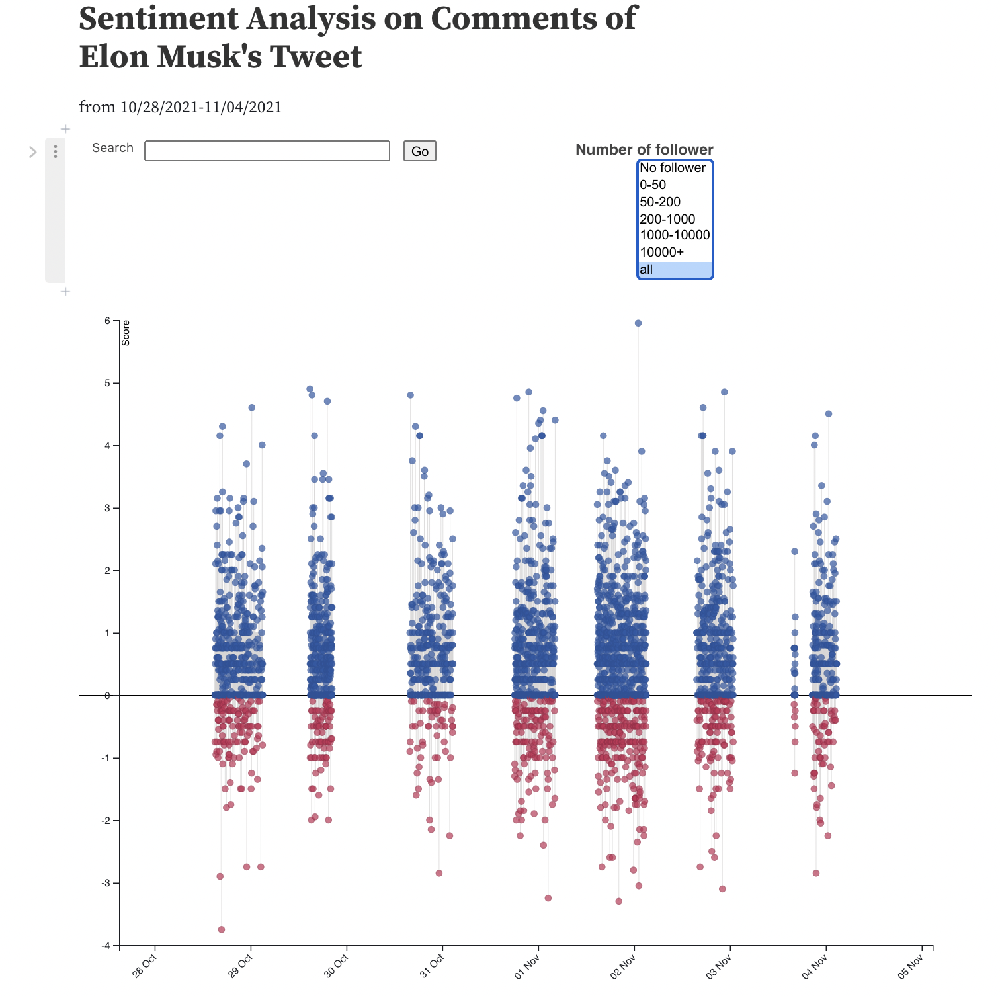

# Interactive component

## Link to the interactive plot

Click [**link here**](https://observablehq.com/d/637d7936589cafb0) or copy the url: https://observablehq.com/d/637d7936589cafb0

## Descriptions

The interactive part of our project was built with D3 on Observable, which is the official web tool for creating and sharing D3 code. We randomly select 1/100 of the original data-set which was collected from 10/28/2021 to 11/04/2021 within several specific time-slots. Based on the LLN, the newly organized data-set with features `user_id`, `created_at`, `follower_count`, `sentiment_score`, `original_text`, `sentiment` can still reflect the true distribution of the sentiment. You can find the data [**here**](https://github.com/JasonSqz/ElonMuskTwitter/tree/main/data) under the ``data`` folder of our repo.

## Instruction for using the map

The plot is initialized with the sentiment score we get after NLP process with no default follower group and comment search specified. The y-axis gives the sentiment score of each comment with color blue reflecting positive and red reflecting negative attitudes.

- User can hover the mouse over a circle to see user id, tweet contents, and sentiment score in detail.

- User can search for exact words in the tweet content posted by Twitter users. For example, entering ``Tesla`` in the search bar and click go will give several data circles in the plot with more positive than negative.

- User can filter the comments based on the number of followers of the user. This function can be used together with the ``search`` function introduced above to present a customized distribution of comments.

Notes:

- The x-axis indicates the date value which is not  continuous because our datasets are not crawled and collected 24 hours each day.

- The score and sentiment results are completely based on the previous NLP process so there are still possibility of misclassification.

- Considering the density of the circles in the plot, move your mouse slowly to the low right part of the exact circle and wait for the tooltip.

- To reset the plot, please left the search bar empty and choose ``all`` for the filter, then click ``Go``, and you will get a default plot like this:

{width=200%} 

 \

Reference: 

- Obeservable: Search Sentiment Analysis of Billboard Top 100 Songs 2000-2018. https://observablehq.com/@vizbiz/search-sentiment-analysis-of-billboard-top-100-songs-2000-2