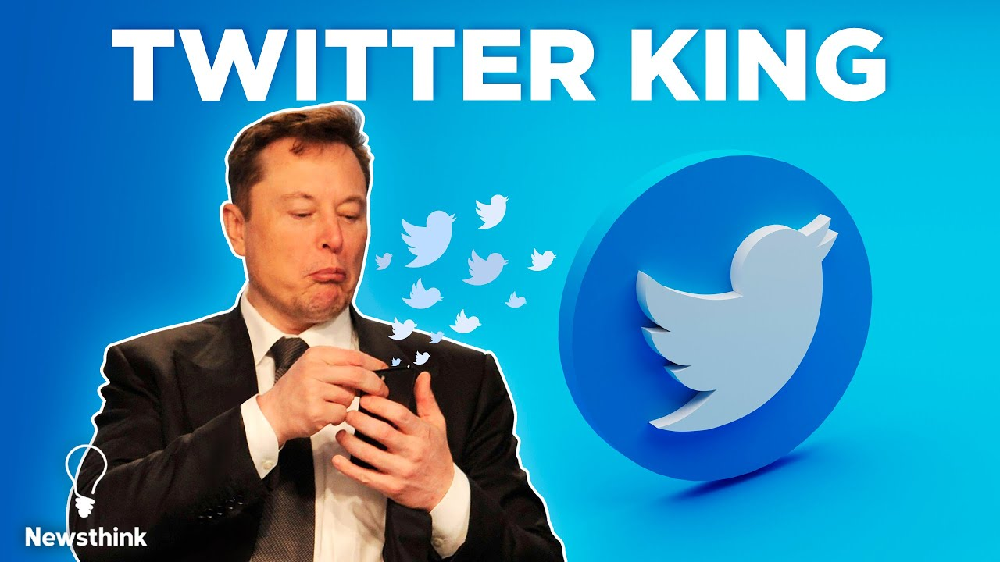

# Conclusion

After processing the raw data and applying some NLP techniques, we gained some insights to Elon Musk and his controversial reputation on Twitter. Looking at the volume of tweets regarding Elon Musk, we saw the increases in volume as controversial events associated with Elon Musk happens. For geological distribution of users, we were able to see that users center in economically more advanced states. We then analyzed the content of tweets. We discovered the most frequent vocabularies and the most prevalent emojis in tweets. Using sentiment analysis, we identified that a large proportion of tweets are either positive or neutral. Users are favoring Elon Musk's remark on Twitter.Moreover, we discovered that the length of tweet and follower count of a user have some effect on the tweet sentiment. Through topic modeling, we were able to identify two large topics of crypto-currency and a combination of Tesla stock and conversation between Elon Musk and United Nation official. These two topics clearly corresponds with the events happening during the period, and users have heated discussion surrounding them. Lastly, filtering using the keywords belonging to each topic, we saw that users are favoring more on Elon Musk's remark on crypto currency. 

Despite all these findings we mentioned in the result part above, there still exist limitations. For the data collection part, since we can only collect streaming data, it is unavoidable to have some time discontinuity in our data. From the time series perspective, this may introduce bias to our analysis. So the conclusions we reached till now are restricted to the specific time-slots. In future improvement, we want to better control the period during which we collect our data or possibly find a cloud server to mount our program. If we are able to derive a complete dataset, a more accurate analysis can be carried out using the same framework. 

In addition, we want to include `conversation_id` in the feature as it would make it much easier to construct a conversation. For example, we will be able to retrieve all tweets replying to the Chinese poem tweet. If so, we could carry out analysis on all corresponding replies and gain some insights into a specific topic with more accurate results. 

In conclusion, it was very effective to conduct analysis using Twitter data, and we were lucky to be collecting in this interesting period. In the end, we want to comment:

{width=80%}

