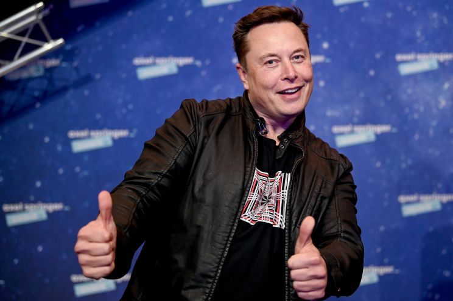

--- 
title: "Analyzing emotions towards Elon Musk on Twitter "
author: "Anni Chen, Zehui Wu, Senqi Zhang"
date: "`r Sys.Date()`"
site: bookdown::bookdown_site
---

# Introduction

Elon Musk, a well-known entrepreneur and business magnate who founded Paypal, SpaceX and Tesla Motors, took back the title of the world's richest person in December 2021 with an estimated net worth of 265 billion dollars. Besides all those miracles and innovations he made in his business empire, he forms a controversial figure on the Internet, especially with his appealing words on Twitter. Till Dec. 2021, he has owned 65.6M followers on Twitter in his 13th year of creating account. There is no doubt that Elon Musk is quite a social media influencer who tweets frequently and expresses opinions on a variety of topics including: spaceX, crypto-currency, Tesla, etc.. Twitter users always have heated discussions surrounding his tweets and associated actions. Based on those facts, we are curious about how people react to Elon Musk's Tweets. We want to visualize user discussions on related topics and explore underlying patterns using various techniques.

{width=50%}

In this project, we collected Twitter streaming data using Tweepy API for a continuous week starting from Nov. 28th, 2021. The tweets collected contain valuable information including: tweet content, user profile, and geological identification. For our analysis, NLP techniques will be applied to calculate the sentiments and classify topics on tweet contents. We consider to carry out analysis at both tweet level and user level and hopefully the geographic and time series information can help answer the following questions:

- What is the volumes of users' tweet regarding Elon Musk over time?

- Is there a geological pattern for users discussing Elon Musk?

- For people who are influential (more followers), will there be a difference in attitude to average Twitter users?

- What are thethe most frequent words/most popular topics in tweets about Elon Musk?

- For individual topics, will there be a difference in the distribution of sentiments ?

For more details of this project, click the [**link here**](https://github.com/JasonSqz/ElonMuskTwitter) or copy the url https://github.com/JasonSqz/ElonMuskTwitter and open it in browser to go to our Github repository and navigate code in ``.Rmd`` files.